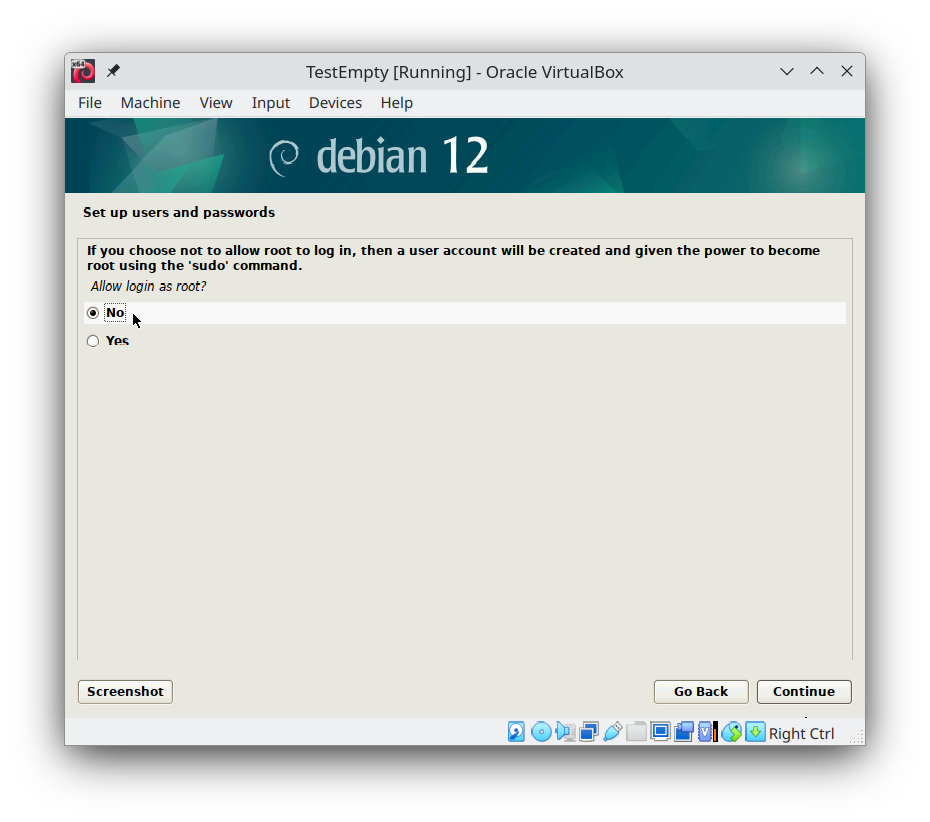
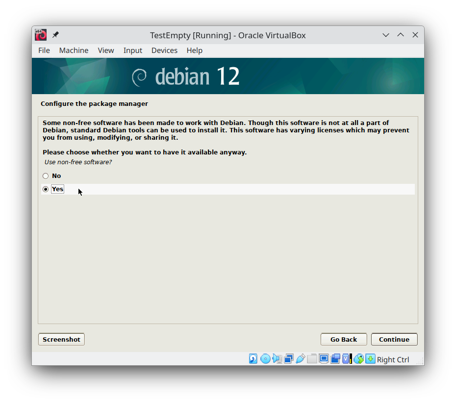
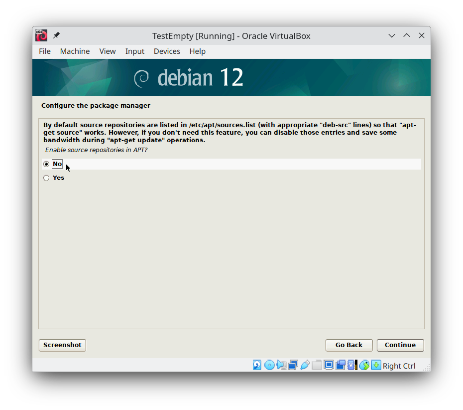
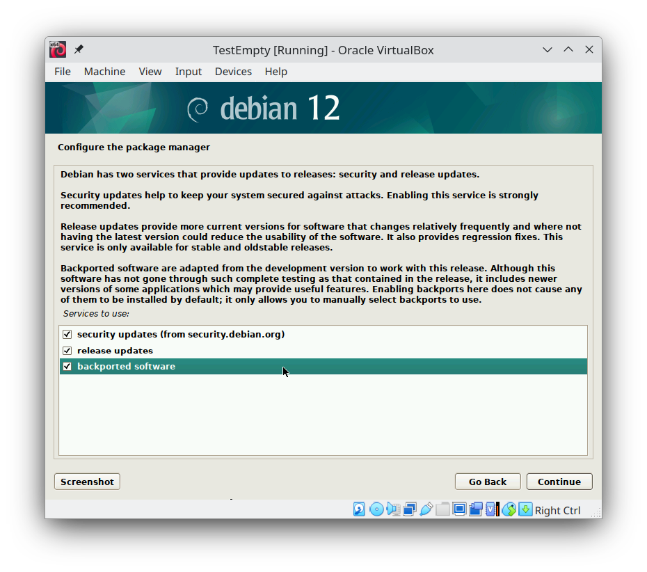
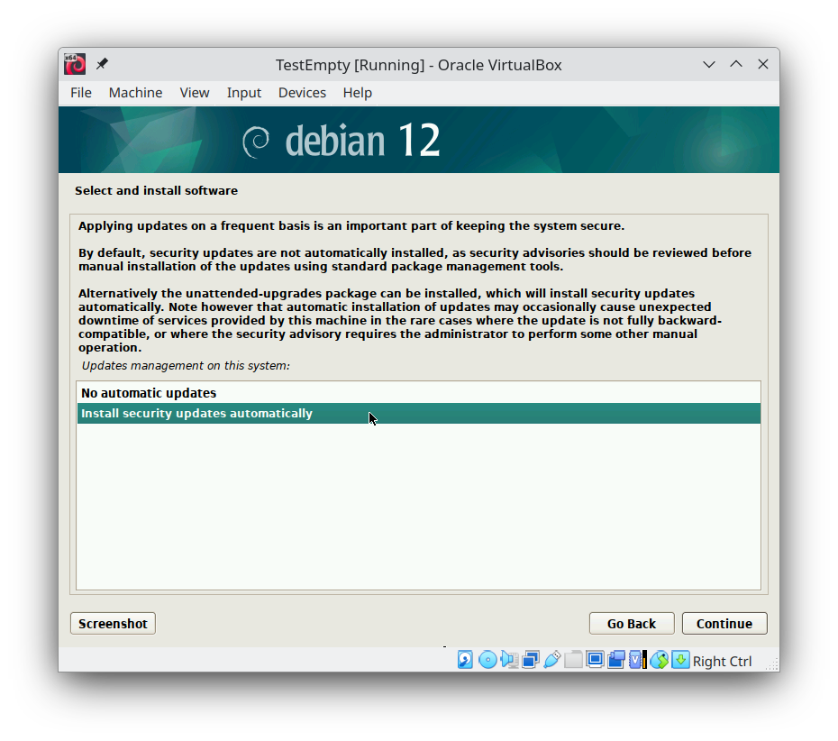
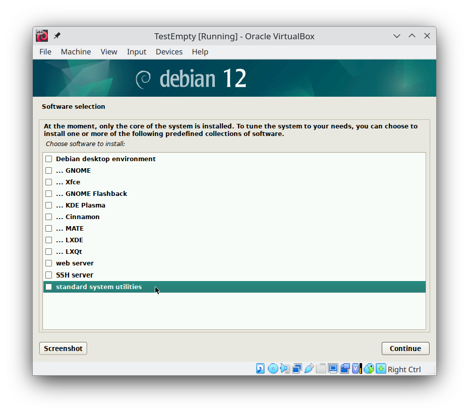
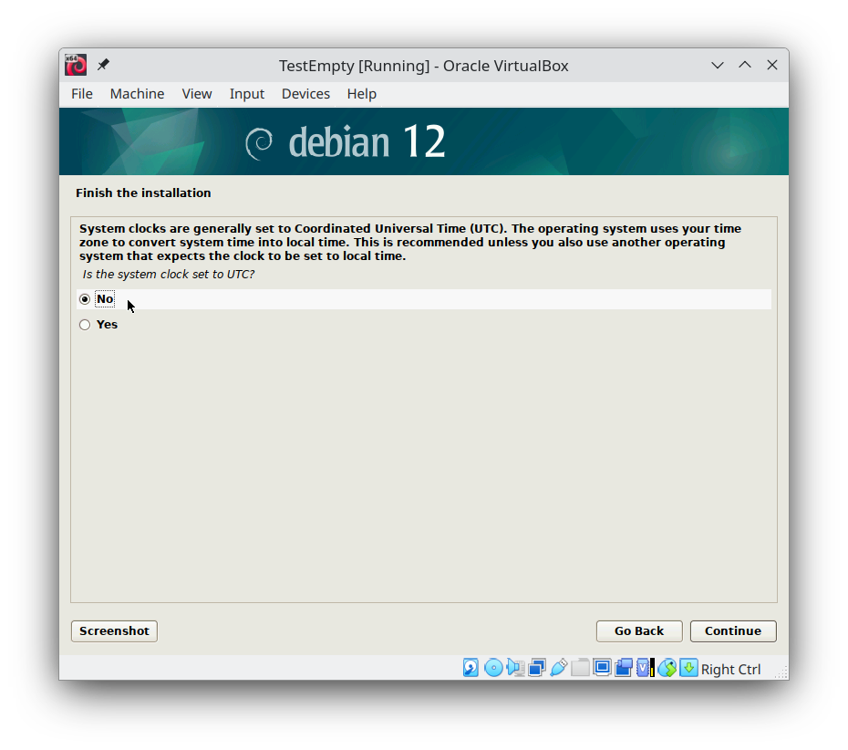
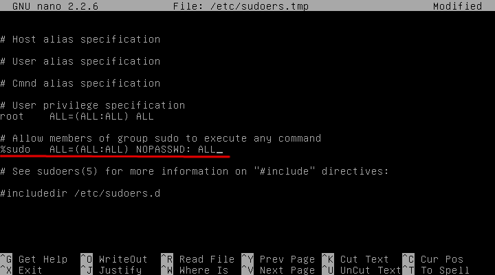
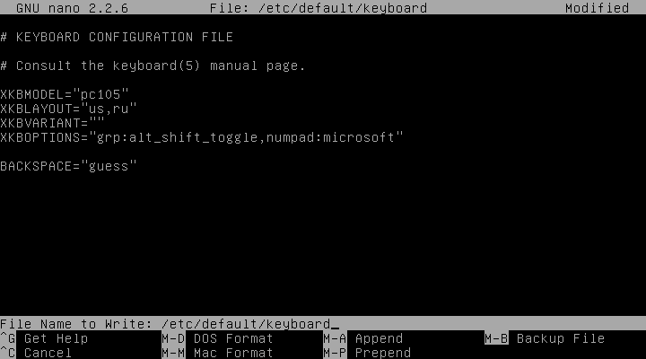

# Building useful HomeStation from ugly Debian

## Introduction

When the [Debian OS](https://www.debian.org/) was released in 1993, I was in my last year of high school. I enjoyed building programs and employing algorithms, and decided to become a programmer. Today, software development is my profession, but, surprisingly, I had never heard of Debian until 2013. At that time, I was looking for a good solution for everyday home computing, while at the same time I needed a virtualization station for developing software on Microsoft Windows and Microsoft Visual Studio for my several clients with a particular environment for each of them.

I started my research by considering using Ubuntu 12.04 and Oracle VirtualBox in parallel with Microsoft Windows 8 and Hyper-V. A problem emerged. Despite its impressive appearance, Ubuntu is not always the most stable OS. However, I tied my best to work with it for about 6 months until the arrival of Debian 7 "Wheezy" in May 2013. Debian was quite a contrast to Ubuntu. It was very fast and stable. Unfortunately, it is butt ugly! It turns out to be quite difficult to make Ubuntu more stable, but fortunately, I figured out how to give Debian a more contemporary appearance, and to work better. Today, Debian 12 "Bookworm" is the primary operating system on my PC.

## Hardware

The stories about compatible hardware for Linux are very funny stories. Probability, the newest hardware will not work on Linux. In addition, `ATI` or [`NVIDIA`](http://www.wired.com/2012/06/torvalds-nvidia-linux/) discrete video card can make an issue. And it is not surprising that everyone is ~~mining cryptocurrencies~~ developing AI technologies these days. That means, NVIDIA is a must, are not you? Fortunately, in `Debian` you can use open source drivers or proprietary (non-fee) drivers that works. Also, fortunately Intel's CPU works very well, especially Intel integrated graphics. I have no idea how to deal with AMD, but last stories about Intel global fails related to his CPU with indexes `K` and `HX` in 2024 raised popularity of AMD CPU.

Despite this, the Intel + Nvidia combination is the most popular now and will probably remain so in the near future. Lots of streamers, lots of gamers, lots of machine learning, lots of slackers. The details have changed, but not the big picture, which has been stable since the Dot-com bubble. Blue plus Green is a good choice for professional jobs, red plus red for... [periphery countries](https://en.wikipedia.org/wiki/Periphery_countries)?

## Software

Debian has at least [three releases](https://www.debian.org/releases/index.html): stable, testing and unstable. Although software in the stable release are old for two or even four years, the stable release of Debian can be a base for building home using or professional using desktop PC. If some software in the stable version is out of date, the user can install the latest version of the software from [Debian backports](https://backports.debian.org/), from [flatpack](https://flatpak.org/), or directly from the vendor's repository. Although I prefer Debian stable, I use the vendor's repositories or flatpack, especially for software that I need to be new.

> Unlike Microsoft Windows, Debian has several [desktop environments and window managers](https://wiki.debian.org/DesktopEnvironment). I prefer simple, fast and useful desktop. Actually, newest Gnome3 and KDE are not on this way. Gnome3 looks strange and unfortunately, WinKey does not work with VirtualBox. This problem there is also in Ubuntu and all other graphical environments based on Gnome3. KDE is very glossy and eats amount of memory, but people often like it. XFCE and LXDE is quite spartan and point for slow or old computers. I prefer middle may, therefore I am used to working with [MATE Desktop Environment](http://mate-desktop.com/). The MATE Desktop Environment has evolved from Gnome2 and offers such a great desktop environment. It is really simple, really fast and really useful...

It was a great speech 10 years ago. Currently, [KDE Desktop Environment](https://kde.org/) is the only competitor. I realized that the software I use in my work is based on QT in 99% of cases. `Krita`, `OBS Studio`, `Shotcut`... `Gimp` died, sad, but true. The exception is the Chromium engine that is based on Gtk.

The problem with KDE is the same as Mate had 10 years ago. Default installation of Debian includes a lot of extra software, that installed with very strong dependencies. It is not possible to install the full KDE and remove that you do not need, like in Ubuntu. We will think out of the box and are starting from minimal Debian installation without desktop environment. After the minimal Debian system was installed we can set up our system and will install and will configure desktop environment and user interface.

## Minimal instalation of Debian

I will not describe the entire installation process in detail. I will only point out specific points that differ from a normal installation. For more information how to install Debian see the [step-by-step instruction](https://debian-handbook.info/browse/stable/sect.installation-steps.html). Usually I am using `expert installation` and here is the main things.

> **WARNING** You may need swap partition more than DRAM, because swap is used for hibernation.

Not allow `root` at all and allow using `sudo` command:


Allow using repositories from Internet:


Allow using non-free drivers:


Allow using non-free software:


We do not need the source code, we will not compile the software from scratch:


Allow using backports:


Allow autoupdate software:


No installation for desktop environment, we will do it later:


Allow using normal time, like in Windows:


## Setting up Debian after minimal installation

After that minimal Debian system was installed there is only console, like oldest `command.com` from MS-DOS. Before installing Desktop Environment, Debian should be prepared and console is enough to do this. The steps below describe how to make Debian looks so good with any desktop environment. Most of the commands in examples should run with sudo command. Also, the preferred console-based text editor can be used for editing configuration files during Debian preparation, for example the GNU `nano` text editor exists in minimal Debian system. Moreover, be ready to provide Debian DVD because most of the packages exist on it.

### 1. SUDO user settings

First step describes how to allow regular users to run a command with administrative privileges. During the Debian installation we added `sudo` group and added our user to that group. Now we will remove requirements to ask for a password every time we run something that require root privileges. This behaviour can be done with help of `visudo` command which will run editor for changing `/etc/sudoers` file. In this file the `%sudo` line should be changed, so the `NOPASSWD: ALL` option will pop at the end of line instead of `ALL` option:

```
sudo visudo
```

Change line starting with `%sudo` to the follwoing:

```
%sudo ALL=(ALL:ALL) NOPASSWD: ALL
```



After reboot sudo command can be able to use without asking user password. Reboot can be done by command:

```
sudo reboot
```

More information about SUDO package in Debian: https://wiki.debian.org/sudo

### 2. SWAP optimization

Swap partition can be everywhere. Debian can keep swap data in partitions or in files or works without swap, but swap partition is necessary for hibernate or virtualization. In some cases using SSD disk for swap is not a good solution. In these cases you are the BOSS, but anyway I recommend reducing swap usage. Reducing swap usage can be setting in `/etc/sysctl.conf` file:

```
sudo nano /etc/sysctl.conf
```

Add the following string at the end of `/etc/sysctl.conf` file:

```
vm.swappiness=1
```

This value (1 in example) should be in percentage of RAM. It means that swap partition will be used in Debian only when there are less than 1% of free RAM.

More information about swap file in Debian: https://wiki.debian.org/Swap

### 3. Keyboard settings

The Debian works with many international keyboards and languages. There is a command for setup keyboard configuration:

```
sudo dpkg-reconfigure keyboard-configuration
```

These command updates `/etc/default/keyboard` file. It is enough to work in a single language environment, but when user wants to work with different languages is not enough. Fortunately, setup of multilingual input for Debian is simple. Keyboard model (`XKBMODEL` option) and language layouts (`XKBLAYOUT` option) are stored in `/etc/default/keyboard` file. Multiple layouts may be specified in a comma-separated list, for example (keyboard with MS Windows keys, American English and Russian language layouts):

```
sudo nano /etc/default/keyboard
```

And the file needs to be changed as follows:

```
XKBMODEL="pc105"
XKBLAYOUT="us,ru"
XKBOPTIONS="grp:alt_shift_toggle,numpad:microsoft"
```

This configuration is very similar to what we usually have working in any office. Let's keep it at home as well.



In additional, switching between language layouts can be lighted by status lights on keyboard. Option `grp_led:scroll` in `XKBOPTIONS` means that Scroll lock status light will be turned on after language layout was changed.

More information about keyboard options in Debian: https://wiki.debian.org/Keyboard

### 4. Nvidia drivers

If you have NVIDIA, you are on the right side, especially if it is AI side. The following command will install Nvidia drivers:

```
sudo apt install nvidia-driver
```

After instalation you have to check this output:

```
sudo cat /sys/module/nvidia_drm/parameters/modeset
```

if it returns `N` then change the `/etc/modprobe.d/nvidia-options.conf` file:

```
sudo nano /etc/modprobe.d/nvidia-options.conf
```

and add this string to the end:

```
options nvidia-drm modeset=1
```

Also, uncomment power manager options for hibernation and sleep.

More information about installing Nvidia drivers in Debian: https://wiki.debian.org/NvidiaGraphicsDrivers

## Instal KDE

We prepared our minimal installation of Debian, now we are ready to sail for the Horn. Let's do it, it is simple:

```
sudo apt install kde-plasma-desktop
```

Remove unnecessary programs:

```
sudo apt purge zutty vim-common debian-faq && sudo apt autoremove
```

## Instal other software


### Archiver

```
sudo apt install ark
```

### Necessary plugins

```
sudo apt install dolphin-plugins aspell-ru hunspell-ru irussian
```

### Alternative package manager

```
sudo apt install synaptic apt-xapian-index software-properties-gtk
```

### Git and Nodejs

```
sudo apt install git nodejs npm
```

and setup settings:

```
git config --global user.email "[user.email]"
git config --global user.name "[user.name]"
```

### Icons

```
sudo apt install papirus-icon-theme faenza-icon-theme numix-icon-theme-circle
```
